<section data-background="./pics/Namiestnik_of_Poland_Palace_during_January_Uprising_1863.PNG" class="text-bg-bw">

  
The Lester and Sally Entin  
Faculty of Humanities 
Department of History 
25/05/2017
<!-- 'Cinzel 
 Marcellus SC 
 'Bentham -->

    <h1 style="outline-color: brown; font-size:250%;font-family: 'Cinzel', serif;" >A Nation of Illustrious Exiles</h1>
    <h3 class="subtitle">The Polish Uprising in the Global Mind</h1>
    
 
Handed in as a Refreat for Dr. Vera Kaplan's course   **'Life Afterwards: Exile and Emigration in Tsarist Russia'**  
By Gill Abarbanel 201483393 

</section>

---
<!--.slide: data-background-image="./pics/polish_eagle.png" class="no-print"-->
<h3>How to traverse this presentation</h3>

Please use <i class="fa fa-chrome" style="color:#FFFFFF;"></i> <code>Chrome</code> or <i class="fa fa-firefox" style="color:#FFFFFF"></i> <code>Firefox</code>

The presentation is best viewed in fullscreen -  you can go to fullscreen by pressing <button id="button" class="mdl-button mdl-js-button mdl-button--raised mdl-js-ripple-effect mdl-button--accent"> here </button>.

Press <code style="font-family: keysFont; font-size: 200%;">f</code> to toggle **f**ullscreen at any time 

#### press <code>↓</code> now
--
<!--.slide: data-background-image="./pics/polish_eagle.png" class="no-print"-->

<h3>How to traverse this presentation</h3>

Every horizontal section is a broad subject 
<code>←</code> and <code>→</code> arrows move between them 
Use the <code>↑</code> and <code>↓</code> to travel deeper into a subject 
--
<!--.slide: data-background-image="./pics/polish_eagle.png" class="no-print"-->
<h3>How to traverse this presentation</h3>

Press o to see an **o**verview of the entire presentation.

Citations are indicated with a [№] and can be viewed by mousing over them.
--
<!--.slide: data-background-image="./pics/polish_eagle.png" class="no-print"-->
<h3>How to traverse this presentation</h3>

The side-menu can be opened by clicking the <i class="fa fa-bars" style="color:#a23"></i> button on the bottom left.

From there, you can navigate the slide or go the <i class='fa fa-book'></i> **Bibliography** or the <i class="fa fa-file-pdf-o" aria-hidden="true"></i> **printable version** of this presentation.  

---
<!--.slide: data-background-image="./pics/hussar.png" class="text-bg-clr"-->
## The Collapse of The Polish-Lithuanian Commonwealth

--
<!--.slide: data-background="#d4213d"-->
### The Polish-Lithuanian Commonwealth
 

--
<!--.slide: data-background-image="./pics/2017-05-23-16-22-19.png" class="blur"-->

--
<!--.slide: data-background-image="./pics/rejtan.png" class="text-bg-clr"-->
### The Polish-Lithuanian Commonwealth

**the polish-lithuanian Commonwealth**   was one of the largest and most populous countries of 16th- and 17th-century Europe. {Wandycz, Piotr Stefan. The Price of Freedom : A History of East Central Europe from the Middle Ages to the Present. Routledge, 2001. pp.66 |  4} However by the middle of the 17th century a string of disastrous wars left their economy in tatters and their political system in turmoil.
--

<!--.slide: data-background-image="./pics/plcw_stratas.png" class="blur"-->

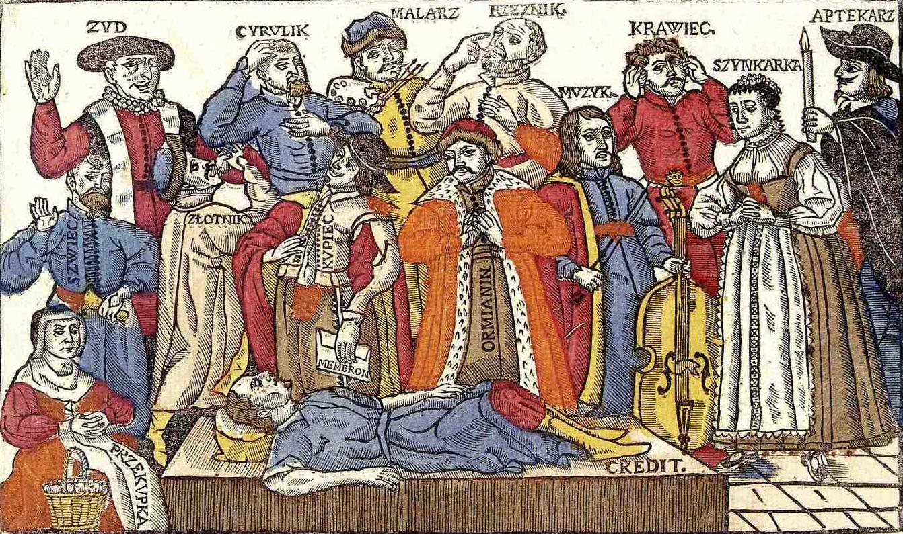

Some social strata in the Polish–Lithuanian Commonwealth's society – 1655.   From the left: Jew, Barber surgeon, Painter, Butcher, Musician, Tailor, Barmaid, Pharmacist, Shoemaker, Goldsmith, Merchant and Armenian.

--

<!--.slide: data-background-image="./pics/2017-05-22-19-04-53.png" class="text-bg-clr"-->

#### The Three Partitions

3 territorial divisions of Poland,
* 1772
* 1793
* 1795

Committed by **Russia**, **Prussia**, and **Austria**

Poland’s size was progressively reduced until the state of Poland ceased to exist.

--
<!--.slide: data-background-image="./pics/2017-05-22-19-04-53.png" class="blur"-->

--

<!--.slide: data-background-image="./pics/2017-05-22-19-04-53.png" class="blur"-->

--

The Partitions became a focal point in European political discourse for years to come, and a rallying call for the oppressed nations in all.

For instance, they were mentioned in _"Il Canto degli Italiani"_, the Italian National Anthem, written in 1847, and were a major topic of discussion in The American _Federalist Papers_ (1787-1788).  

--
<!--.slide: data-background-image="./pics/burke_letter.png" class="text-bg-txt" -->

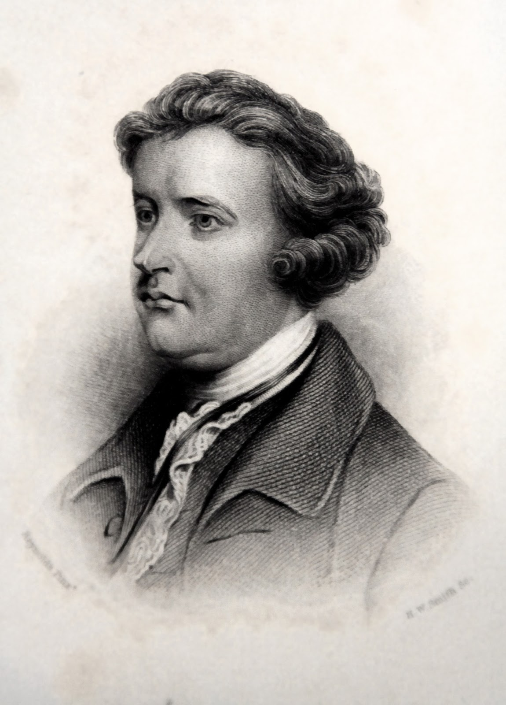 <!--.element: style="width: 200px; float: right;z-index: 100;right:-50px;position: relative;"-->
<blockquote>
No wise or honest man,” wrote **Edmund Burke**, “can approve of that partition, or can contemplate it without prognosticating great mischief from it to all countries at some future time.{Burke, Edmund. <i> A letter from the Rt. Honourable Edmund Burke to His Grace the Duke of Portland </i>,  on the conduct of the minority in Parliament. Containing fifty-four articles of impeachment against the Rt. Hon. C. J. Fox.  [microform] From the original copy, in the possession of the noble duke  printed for the editor, and sold by J. Owen London  1797 http://purl.ox.ac.uk/ota/4019  p.31 |2} 
</blockquote>

--
<!--.slide: data-background-image="./pics/burke_letter.png" class="text-bg-txt" -->

 <!--.element: style="width: 200px; float: right;"-->
“No wise or honest man,” wrote **Edmund Burke**, “can approve of that partition, or can contemplate it without prognosticating great mischief from it to all countries at some future time.”{Burke, Edmund. <i> A letter from the Rt. Honourable Edmund Burke to His Grace the Duke of Portland </i>,  on the conduct of the minority in Parliament. Containing fifty-four articles of impeachment against the Rt. Hon. C. J. Fox.  [microform] From the original copy, in the possession of the noble duke  printed for the editor, and sold by J. Owen London  1797 http://purl.ox.ac.uk/ota/4019  p.31 |2} 

###### Interesting to note  
He later added: "The purpose of the introduction of Polish politics into this discusion, was not for the sake of Poland; it was to throw an odium upon those who are obliged to decline the cause of justice from their imposibility of supporting a cause which they approve"  

-- 
Nikolay Karamzin: 
<blockquote>
Let foreigners condemn the partition of Poland - we took what was ours.. {Karamzin, Nikolaĭ Mikhaĭlovich,. Karamzin’s Memoir on Ancient and Modern Russia: A Translation and Analysis (Ann Arbor: 2005). http://hdl.handle.net/2027/mdp.39015062623338. p.132 | 32}
</blockquote>
--
<!--.slide: data-background-image="./pics/duchy_of_warsaw.png" class="text-bg-clr"-->
In 1807 the Polish State was briefly restored, albeit on a much smaller scale, when **Napoleon** set up the short-lived **Duchy of Warsaw**

--
<!--.slide: data-background-image="./pics/congress_vienna.png" class="text-bg-bw"-->
After Napoleon's defeat, the Russian-dominated **Congress Kingdom of Poland** was created by decree of the Congress of Vienna in 1815.

--
<!--.slide: data-background-image="./pics/sejmCongressPoland.png" class="text-bg-bw"-->

### The Kingdom of Poland
Colloquially named **Congress Poland** was governed by the 
###### Sejm of Congress Poland
###### (_Sejm Królestwa Polskiego_] 
between 1815 to 1831.

--
<!--.slide: data-background-image="./pics/sejmCongressPoland.png" class="text-bg-bw"-->

On the 27 of November 1815 the **Constitution of the Kingdom of Poland** (_Konstytucja Królestwa Polskiego_) was signed by the Tsar and King of Poland, **Alexander I**.

Roman Catholicism was recognized as the religion of the state, but other religions were tolerated.

Liberty of the press was promised subject to the passing of a law to restrain its abuses.

Individual liberty, the use of the Polish language in the law courts, and the exclusive employment of Poles in the civil government were secured by the constitution.
{Steed, Henry Wickham, David Hannay, and W Alison Phillips. “A Short History of Austria-Hungary and Poland.” London: The Encyclopaedia Britannica Co., 1914. file://catalog.hathitrust.org/Record/006568137.p.137 | 1}
--

But in 1819 Alexander I limited the freedom of the pressand introduced  heavy censorship.
Russian secret police commanded by **Nikolay Nikolayevich Novosiltsev** started infiltration and persecution of Polish clandestine organizations, and in 1821 the Tsar ordered the abolition of freemasonry.

--
<!--.slide: data-background-image="./pics/sejmCongressPoland.png" class="text-bg-bw"-->

Under Article 3 (On the Namiestnik and Council of State) of the new constitution, the office of the 
###### _**Namiestnik**_ 
was introduced (Polish: namiestnik Królestwa Polskiego, Russian: наместник Царства Польского) as the deputy of the King of Poland (Tsar of Poland). 

--
### Namiestniks of the Kingdom of Poland

    <ol>
        <li> Józef Zajączek (1815–26)</li>
        <li> Vacant, 1826–31 (power and responsibilities were exercised by the Administrative Council)</li>
        <li> Ivan Paskevich (1831–55)</li>
        <li> Mikhail Dmitrievich Gorczakow (1855 – 3 May 1861)</li>
        <li> Nikolai Sukhozanet (16 May 1861 – 1 August 1861)</li>
        <li> Karl Lambert (1861)</li>
        <li> Nikolai Sukhozanet (11–22 October 1861)</li>
        <li> Alexander von Lüders (November 1861 – June 1862)</li>
        <li> Grand Duke Konstantin Nikolayevich of Russia (June 1862 – 31 October 1863)</li>
        <li> Friedrich Wilhelm Rembert von Berg (1863–74)</li>
    </ol>

--

The importance and role of the Namiestniks changed throughout the periods.
Certainly from 1815 to 1831 the Congress Kingdom's military was controlled by **Grand Duke Constantine Pavlovich** of Russia, who _de facto_ had more power than the namiestnik, **Józef Zajączek**. 
--
Zajączek died in 1826 and was not replaced until 1831, when the November 1831 Uprising saw **Ivan Paskevich** assume the post of namiestnik—as well as command of Russian military forces in the region, as he was tasked with defeating the Uprising. 
The question of who controlled the military after Paskevich's death is unclear, but again the last namiestnik, **Fyodor Berg**, was tasked with crushing another Polish uprising—the January 1863 Uprising—and commanded the military.

---
<!--.slide: data-background-image="./pics/novemberUprising.png" class="blur"-->

## 1830-31 Rebellion
### the November Uprising

Background:  
<i>Marcin Zaleski,</i> <b>Taking of the Warsaw Arsenal on November 29, 1830.</b> (1830)  

 
--

Upon Nicolas I succession, the crown began limiting the liberties that existed under the constitutional monarchy in Congress Poland, whose predecessor, Alexander I, famously bestowed in his liberal-leaning approval of the 1815 Constitution of the Kingdom of Poland. 

After 1825 the Polish Sejm was forced to hold its sessions in secret, while Nicholas I formally crowned himself as King of Poland on 24 May 1829 in Warsaw, to the dismay of the Polish political elites.

--
<!--.slide: data-background-image="./pics/warsawInfantry.png" class="text-bg-bw"-->

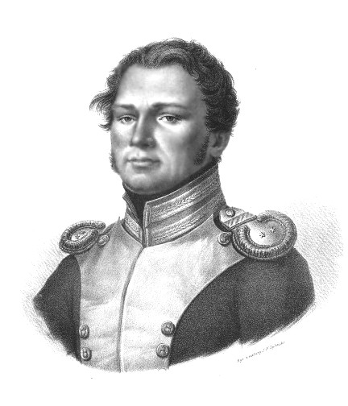 <!--.element: style="width: 200px; float: right;right:-50px;z-index: 100;position: relative;"-->

In 1828, under the command of Lt. **Piotr Wysocki** of the Warsaw School of Cadets, a conspiracy to assassinate the the Grand Duke Constantine was hatched. 

It took time for the conspirators to materialize their aspirations, though. But eventually the political turmoils of 1830 drove the delicate balance over the edge.

--

In July a revolution broke out in France, and in August the Belgians began rising for their independence from the Netherlands. These insurrections led the Tsar to prepare for an armed intervention against Belgium, and possibly even France.

On the 19th of November the crown announced a state of increased combat readiness for the Russian Army and the Russian controlled Polish troops.

The cadets decided to take immediate action.
--

It was planned to take place on the 29th of November 1830 - when the lieutenant interrupted an evening tactics class and proclaimed:

<blockquote>
Poles! This is the hour of revenge. Today, we must triumph or perish! Let us charge, and let your breasts be the Thermopylae for your enemies! 
</blockquote>

--
<!--.slide: data-background-image="./pics/1830warsawPark.png" class="text-bg-clr"-->

The soldiers then proceeded to attack the Belweder Palace, the main seat of the Grand Duke, but failed to capture him. They then captured the city's main arsenal, while in the following days Polish civilians took arms and forced the Russian troops to withdraw north of Warsaw.  

--

In reply to the rapid and unexpected turn of events, the Polish government (Administrative Council) assembled immediately. It was decided that unpopular ministers were to be removed and men like Prince Adam Jerzy Czartoryski, the historian Julian Ursyn Niemcewicz and General Józef Chłopicki take their places. 

--
<blockquote>
Czartoryski had been rightly described as the central but not
the leading figure of the insurrection. He did not seek power. He
assumed the presidency in part because he felt a sense of duty
toward his countrymen and his name attracted the support of the
nobility, and in part because his life-long experience in diplomacy
uniquely qualified him to conduct his country's foreign policy. The
prince was not a born leader of men, and he was often unfortunate
in his choice of associates. {Wandycz, Piotr Stefan. The Lands of Partitioned Poland, 1795-1918, 1974. https://getit.library.nyu.edu/link_router/index/125880316. p.110 |1}
</blockquote>

--

The situation in the Kingdom further radicalized. On December 20, the Parliament issued a manifesto in which it announced a national uprising against Russia, presenting to the nations of the world its reasons for the rebellion.

-- 
<!--.slide: data-background-image="./pics/our_freedom_and_yours.png" class="blur"-->

For our Freedom and Yours

--
<!--.slide: data-background-image="./pics/sejmCongressPoland.png" class="blur"-->

Deposing of tsar Nikolay by the Polish Sejm in 1831

--
On October 5, 1831, in the vicinity of Brodnica, the last branch of a large Polish army (20,000 soldiers) crossed the border to Prussia, where he was interned, and on October 9th, the Modlin Fortress capitulated, and the fortress Zamosc on the 21 October.

The latter date is considered to be the end of the November Uprising.

--

<blockquote style="text-align:left">
Ступайте ж к нам: вас Русь зовет!
  Но знайте, прошеные гости!
  Уж Польша вас не поведет:
  Через ее шагнете кости!...»
  Сбылось — и в день Бородина
  Вновь наши вторглись знамена
  В проломы падшей вновь Варшавы;
  И Польша, как бегущий полк,
  Во прах бросает стяг кровавый —
  И бунт раздавленный умолк.{From Pushkin's poem celebrating the anniversiry of Battle of Borodino - 7/9/1812  http://rvb.ru/pushkin/01text/01versus/0423_36/1831/0565.htm | 2}
</blockquote>

--
After crushing an insurrection in 1831, the Congress Kingdom's autonomy was abolished and Poles faced confiscation of property, deportation, forced military service, and the closure of their own universities.
---
<!--.slide: data-background-image="./pics/Les_polonais_recus_en_Belgique.jpg" class="text-bg-bw"-->

## The Great Immigration
### Wielka Emigracja

--
<!--.slide: data-background-image="./pics/MWP_1830_Le_réfugié_polonais.jpg" class="text-bg-bw"-->

<blockquote style="font-size:70%;">
After the collapse of the insurrection the Polish political, ideological, and cultural center shifted abroad. Plans for an emigration en masse existed already in the last stages of the war and resulted in the departure of most members of the government, ministers, many Sejm deputies, generals, junior officers, and common soldiers. A large number of the leaders of the Left went abroad hoping to achieve, in cooperation with Western revolutionaries, the political ascendency that had eluded them in the kingdom. The emigres numbered some nine thousand people. Two-thirds of them were of noble background-although few were magnates-and one-third were of urban-plebeian or peasant origin. Officers outnumbered common soldiers. As a result of this exodus, Paris, where many of the emigres settled, became a veritable headquarters of Polish national life. The emigration represented an elite of the nation and counted among its members some of the greatest names in Polish literature, history, music, and political thought. {Wandycz, Piotr Stefan. The Lands of Partitioned Poland, 1795-1918, 1974. https://getit.library.nyu.edu/link_router/index/125880316. p.117 |1} 
</blockquote>
--
<!--.slide: data-background-image="./pics/MWP_1830_Le_réfugié_polonais.jpg" class="text-bg-bw"-->

<blockquote style="font-size:75%;">
Historians call this phase the 'Great Emigration'. This name is somewhat misleading, since it may imply that very large numbers of Poles left their country. In fact, the number of emigrants, who should more appropriately be called 'exiles', probably did not exceed 5000-6000 at any time between I83I and the beginning of great economic migration in the last quarter of the nineteenth century. The 'Great Emigration' was primarily a self-imposed exile of members of the revolutionary government and diet of 1830-1. [...]
</blockquote>
--
<!--.slide: data-background-image="./pics/MWP_1830_Le_réfugié_polonais.jpg" class="text-bg-bw"-->
<blockquote style="font-size:75%;">
In addition to the politicians, some officers and men who were released from Prussian or Austrian internment camps sought refuge in France, England and Switzerland. However, the greatness of this emigration lay not in its military significance but rather in its contribution to the maintenance of Polish cultural values suppressed in Poland by the Occupying Powers.{Zubrzycki, J. “Emigration from Poland in the Nineteenth and Twentieth Centuries.” Population Studies 6, no. 3 (1953). http://www.jstor.org/stable/2172378. p.248| 1}
</blockquote>
--
<!--.slide: data-background-image="./pics/demSocManifestoXL.png" class="text-bg-txt"-->

On 4 December 1836 the **Polish Democratic Society**, which broke from Lelewel's National Committee in early 1832, published the _Manifesto of the Polish Democratic Society_ {http://jbc.bj.uj.edu.pl/dlibra/pubindex?startint=1300&attId=$%7BstringAtt%7D&dirids=563| 3} in France, with an English translation published in the spring of 1837. {Leslie, R F. Reform and Insurrection in Russian Poland, 1856-1865. London: University of London, Athlone Press, 1963. p.12| 1}

--
<!--.slide: data-background-image="./pics/demSocManifestoXL.png" class="text-bg-txt"-->

<blockquote>
The Polish Democratic Society was by far the most important group of emigrants, not so much because of the number of members as because of its organization, its clearly formulated program, and its later influence on the country.{Kieniewicz, Stefan. The Emancipation of the Polish Peasantry. Chicago: University of Chicago Press, 1969. https://quod.lib.umich.edu/cgi/t/text/text-idx?c=acls;cc=acls;view=toc;idno=heb05016.0001.001 pp.102-105 |1}
</blockquote>
--
<!--.slide: data-background-image="./pics/demokratiaPolski.png" class="text-bg-txt"-->

It echoed the opinions of the left wing _émigré_ circles, which criticized the November Uprising sejm for its narrow exclusiveness and disregard for thr masses, for if they did:

--
<!--.slide: data-background-image="./pics/demokratiaPolski.png" class="text-bg-txt"-->

<blockquote>
The people would have risen as one man, have braced the gauntlet of war [..] and crushed the invaders without foreign aid"

They called for "the next revolution not to be a sad repetition of the past - the first battle cry must be **the emancipation of the people**, their restoration unconditionally to the ownership of the soil, [..] the restitution of their rights, the admission of all, without distinction of birth or creed, to the the enjoyment of the blessing of independence
</blockquote>

---

<!--.slide: data-background-image="./pics/1832_london_conference.png" class="blur"-->

# International Reaction

--
<!--.slide: data-background-image="./pics/1863battle0.png" class="text-bg-clr"-->

The uprising sparked the imagination of many Europeans, who viewed the struggle of the "poor oppressed Poland" as the blooming of nationality and liberty.

--

### The Literary Association of the Friends of Poland 

Was founded in Britain on the 25th of February 1832 by the Scottish poet **Thomas Campbell** {Noted for his 1799 poem _The Pleasures of Hope_, with his indignation over the turmoils of the Polish nation |1} and the German lawyer **Adolphus Bach**.

Its central purpose was to keep the flame of public support for the Polish suffering in the aftermath of the failed November Uprising.

--
<!--.slide: data-background-image="./pics/pleasuresOfHope.png" class="text-bg-bw"-->

#### From _The Pleasures of Hope_ by **Thomas Campbell** {The Pleasures of Hope; with other Poems. By Thomas Campbell. 1799 http://spenserians.cath.vt.edu/TextRecord.php?textsid=37917 |1}

Oh! sacred Truth! thy triumph ceas'd awhile,
  And Hope, thy sister, ceas'd with thee to smile,
  When leagu'd Oppression pour'd to Northern wars
  Her whisker'd pandoors and her fierce hussars,
  Wav'd her dread standard to the breeze of morn,
  Peal'd her loud drum, and twang'd her trumpet horn;
  Tumultuous horror brooded o'er her van,
  Presaging wrath to Poland — and to man!
  
  Warsaw's last champion from her height survey'd
  Wide o'er the fields, a waste of ruin laid,—
  Oh! Heav'n! he cried, my bleeding country save!—
  Is there no hand on high to shield the brave?—
  Yet, though destruction sweep these lovely plains,
  Rise, fellow men! our country yet remains!
  By that dread name we wave the sword on high,
  And swear for her to live! — with her to die!
  

--
<!--.slide: data-background-image="./pics/pleasuresOfHope.png" class="text-bg-bw"-->

  He said, and on the rampart-heights, array'd
  His trusty warriors, few but undismay'd;
  Firm-pac'd and slow, a horrid front they form,
  Still as the breeze, but dreadful as the storm;
  Low murm'ring sounds along their banners fly,
  Revenge, or death, — the watch-word and reply;
  Then peal'd the notes, omnipotent to charm,
  And the loud tocsin toll'd their last alarm!—
  
  In vain, alas! in vain, ye gallant few!
  From rank to rank your volley'd thunder flew:—
  Oh! bloodiest picture in the book of Time,
  Sarmatia fell, unwept, without a crime;
  Found not a generous friend, a pitying foe,
  Strength in her arms, nor mercy in her woe!
  Dropt from her nerveless grasp the shatter'd spear,
  Clos'd her bright eye, and curb'd her high career;—
  Hope, for a season, bade the world farewell,
  And Freedom shriek'd — as KOSCIUSKO fell!

--
<!--.slide: data-background-image="./pics/songOfWarsaw.png" class="text-bg-bw"-->

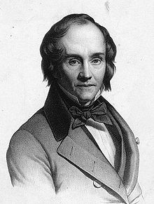 <!--.element: style="width: 200px; float: right;"-->
#### "Warszawianka 1831 roku", 
##### "La Varsovienne"   ("The Song of Warsaw 1831") 

Written in support of the November Uprising by the French poet **Jean-François Casimir Delavigne** (1793  1843) who was enthralled by the news of the uprising.

The lyrics were later translated into Polish by the historian, poet and co-founder of the _Bibliothèque polonaise de Paris_ **Karol Sienkiewicz**. (1793 - 1860) {Under the pseudonym of <i>Exilé de Pologne</i> |2}

--
<!--.slide: data-background-image="./pics/warsawSong31Notes.png" class="text-bg-bw"-->
THE SONG OF WARSAW 1831

Today is a day of blood and glory,
  That it be a day of resurrection!
  Gazing at France’s star,
  The White Eagle launches into flight.
  And it, inspired by hope,
  Calls to us from on high:
  "Arise, oh Poland, break your chains,
  Today is a day of victory or death!"
  
  Hey, whoever is a Pole, to your bayonettes!
  Live, freedom, oh Poland, live!
  Let this worthy battle cry:
  Sound forth to our foes!
  Sound forth to our foes!
  
  Oh Frenchmen! Are our wounds
  Of no value for you?
  At Marengo, Wagram, Jena,
  Dresden, Leipzig, and Waterloo
  The world betrayed you, but we stood firm.
  In death or victory, we stand by you!
  Oh brothers, we gave blood for you.
  Today you give us nothing but tears.
  
  Hey, whoever is a Pole, to your bayonettes!
  Live, freedom, oh Poland, live!
  Let this worthy battle cry:
  Sound forth to our foes!
  Sound forth to our foes!

--
<!--.slide: data-background-image="./pics/jacksonianAmerica.png" class="text-bg-clr"-->

###### And in the USA:

<blockquote>
A wave of Polonophilia swept over Jacksonian America; when hardly a day went by without some sympathetic mention of Poland in newspaper editorials; when banners for the Polish insurgents were dedicated in Boston, Polish dances were taught in New York dancing schools, a plethora of amateur verse on Polish themes found its way into print, and public protest meetings and collections were undertaken throughout the country. {Wieczerzak, Joseph. “American Reactions to the Polish Insurrection of 1863.” Polish American Studies, 1965, p.92| 1}
</blockquote>

--
<!--.slide: data-background-image="./pics/1832_london_conference.png" class="blur"-->

*Honoré Daumier*'s cartoon of the 1832 *London Conference*, with France depicted as a timid hare in front of other powers   (Poland is the female figure trampled upon by Russia)

---
<!--.slide: data-background-image="./pics/Zanonni_Carte_De_La_Pologne.jpg" class="text-bg-clr"-->
### Paskiewicz Period 
#### (1831-1856)

--
<!--.slide: data-background-image="./pics/Zanonni_Carte_De_La_Pologne.jpg" class="text-bg-clr"-->
In the decades following the November Uprising both sides of the Polish nationalist spectrum saw little success in raising the masses or in the international sphere, even though the 1840s saw a few disturbances around Greater Poland.

Overall -  
##### <q>"Order Reigns in Warsaw"</q> { The infamous words of the French foreign m inister <b>Horace Sébastiani</b> in the Chamber of Deputies about situation in Poland.   September 16 1831 |1} 

was the ominous phrase of the time.

--
<!-- .slide: data-background="white" -->

_L'ordre règne à Varsovie_ (1831) by Jean Ignace Isidore Gérard

--
<!--.slide: data-background-image="./pics/1861Warsaw2.png" class="text-bg-bw"-->
But the cultural leaders of the Great Emigration worked to sustain the Polish national spirit and its cause in the European public sphere. 

"Their ideas of Polish messianism, of Poland rising from the dead to lead Europe to a new Kingdom of God on Earth, caught on among segments of a new generation of youthful Poles who accepted sacrifice as a necessary ingredient for the salvation of Poland." {Kutolowski, John F. “Polish Exiles and British Public Opinion: A Case Study of 1861-62.” Canadian Slavonic Papers / Revue Canadienne Des Slavistes 21, no. 1 (1979). http://www.jstor.org/stable/40867415. p.46 |1}

---
<!--.slide: data-background-image="./pics/1861Warsaw7.png" class="text-bg-bw"-->

# 1861 Warsaw Upheavals

--
<!--.slide: data-background-image="./pics/1861Warsaw1.png" class="text-bg-bw"-->

Up until the first turmoils in Warsaw, one could say that the Russian occupation operated through a regime of repression and appeasment.

--
<!--.slide: data-background-image="./pics/Gorczakow2.png" class="text-bg-bw"-->
#### Michaił Dymitrowicz Gorczakow, 
#####  Михаил Димитрович Горчаков

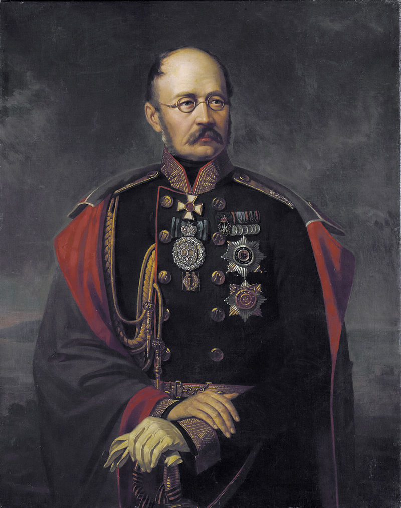 <!--.element: style="width: 200px; float: right;right:-50px;z-index: 100;position: relative;"-->

Appointed in 1856 by Alexander II as the governor of the Polish Kingdom .
--
<!--.slide: data-background-image="./pics/1861Warsaw2.png" class="text-bg-bw"-->

"The regime was universally disliked, but it was not universally opposed" {Kieniewicz, Stefan. “Polish Society And The Insurrection Of 1863.” Past and Present 37, no. 1 (1967): 130–48. doi:10.1093/past/37.1.130. p.132 | 1}

Most of the occupation army was composed of Poles, and "in some way, every social group collaberated with the hated regime" {ibid |1}

--
<!--.slide: data-background-image="./pics/1861Warsaw6.png" class="text-bg-bw"-->
<blockquote>
The peasant alone had no share in this collaboration, but it was the peasant who tended to expect an improvement in his condition from 'the good emperor' {ibid | 1}
</blockquote>

--
<!--.slide: data-background-image="./pics/1861Warsaw4.png" class="text-bg-bw"-->

In June of 1860, the streets of Warsaw became the place of marches and demonstrations. They began with a display of Sowińska general's funeral,the widow of the legendary commander of the defense of Wola in 1831.

--
<!--.slide: data-background-image="./pics/1863battle1.png" class="text-bg-clr"-->

Then came the demonstrations during the October conference of the leaders of the occupying powers, and demonstrations on the anniversary of the November uprising and its subsequent anniversaries of events.

Gorczakow did not initially respond to the demonstrations, it was only under the pressure of St. Petersburg that police and military were sent to the streets of Warsaw. 

The first procession dispersed February 25, 1861, and two days later a volley of Cossacks sent to quite the demonstrators killed five people.

--
<!--.slide: data-background-image="./pics/DelegacjaMiejska.png" class="text-bg-bw"-->

Gorczakow, fearing that further clashes could erupt into open fighting,  first withdrew the army from the streets and agreed to set up, on the night between the 27 and 28 of February, a **City Delegation** (Delegacja Miejska) issued on behalf of society Polish address to the Tsar.

--
<!--.slide: data-background-image="./pics/DelegacjaMiejska.png" class="text-bg-bw blur"-->

--
<!--.slide: data-background-image="./pics/DelegacjaMiejska.png" class="text-bg-bw"-->

It was composed of 14 members, representing different classes of the town. They were:

<ul class="small">
 <li> Banker Leopold Kronenberg </li>
 <li> Writer Józef Ignacy Kraszewski </li>
 <li> Doctor Tytus Chałubiński </li>
 <li> Photographer Karol Beyer </li>
 <li> Merchant Franciszek Ksawery Szlenkier</li>
 <li> Teofil Piotrowski</li>
 <li> Banker Mathias Rosen </li>
 <li> Journalist Józef Kenig </li>
 <li> Józef Wyszyński</li>
 <li> Jakub Piotrowski</li>
 <li> Father Józef Stecki </li>
 <li> Shoemaker Stanisław Hiszpański</li>
 <li> Frankist Jew Jakub Lewiński </li>
 <li> Attorney August Trzetrzewiński</li>
</ul> 

--
<!--.slide: data-background-image="./pics/DelegacjaMiejska.png" class="text-bg-bw"-->

Together with representatives of the Agricultural Society, the delegation drafted an address Emperor Alexander II, submitted to the governor of the Polish Kingdom Mikhail Gorczakow .

--
<!--.slide: data-background-image="./pics/1861Warsaw3Newspaper.png" class="text-bg-bw"-->

But the Tsar refused to accept the delgation's address, and Gorczakow, recognizing the danger of an uprising, concealed the fact of the rejection, agreed to ostentatious funerals of the victims of the February clashes, ordered the army and police to withdrew from the streets, and entrusted the policing to vigilante.

--
<!--.slide: data-background-image="./pics/1863battle2.png" class="text-bg-clr"-->

At this point in the political saga appeared Margrave **Aleksander Wielopolski**, leader of the compromising faction, professing the idea of _organic work_. Wielopolski received a promise from Gorczakow to transfer the supervision of the education system to the Polish noble, to re-activate the Polish higher education and to create a local government in the Kingdom.

--
### Alexander Wielopolski (1803-1877)

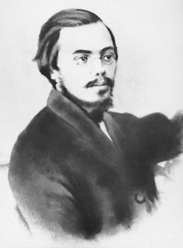 <!--.element: style="width: 200px; float: right;right:-50px;z-index: 100;position: relative;"-->

Appointed chief admin in 1861 by Alexander II. Led an agenda of limiting Polish autonomy through an 1832 statute, drafting Polish civil servants into the imperial bureaucracy.

--
<!--.slide: data-background-image="./pics/1863battle3.png" class="text-bg-clr"-->

### The Agricultural Society
#### Towarzystwo Rolnicze

Founded in November 24, 1857 by Count **Andrzej Artur Zamoyski** (2 April 1800 – 29 October 1874)

Disbanded by Aleksander Wielopolski on April 6, 1861 

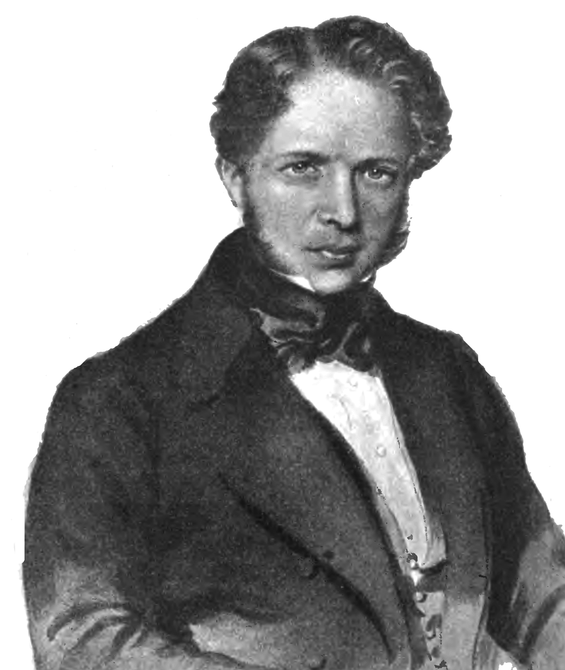 <!--.element: style="width: 200px; float: right;right:-50px;z-index: 100;position: relative;"-->

The disbanding sparked a demonstration in Castle Square in Warsaw which, in the Polish public opinion, though is doubtful corrabarated by the actual events, saw 100 people killed and approximately 200 wounded.

--
<!--.slide: data-background-image="./pics/8April1861-CastleSqr.png" class="blur"-->

Russian army shoots at demonstrators at the Castle Square in Warsaw , April 8, 1861 years

--
<!--.slide: data-background-image="./pics/1861Warsaw5.png" class="text-bg-bw"-->

After a series of patriotic riots, the Russian Namestnik General Karl Lambert, introduced martial law in Poland on 14 October 1861. Public gatherings were banned and some public leaders were declared outlaws.

--
<!--.slide: data-background-image="./pics/Warsaw1861.jpg" class="blur"-->

Russian army in Warsaw during martial law 1861

--
<!--.slide: data-background-image="./pics/Kosciuszko.png" class="text-bg-clr"-->

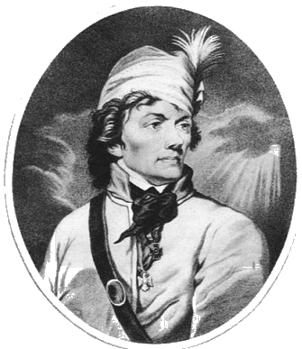 
**15 October 1861** -  
A protest on anniversiry of the death of Tadeusz Kościuszko (1817) - whose failed uprising in 1794 against the Russian opressors made him a martyr of the Polish national cause - turned violent, when crown soldiors fired shots at the agitated crowd. 

--
<!--.slide: data-background-image="./pics/1863battle4.png" class="text-bg-clr"-->

Thus in 1861 the status-quo abruptly collaped. 

The triumph of Garibaldi, and the achivments of Cavour excited both the patriotic youth and the nationalist elites, while an atmosphere of pending reforms hung in the air.

## The Poles had ceased to obey.{Kieniewicz, Stefan. “Polish Society And The Insurrection Of 1863.” Past and Present 37, no. 1 (1967). doi:10.1093/past/37.1.130. p.133 | 1}

---
<!--.slide: data-background-image="./pics/1863battle5.png" class="text-bg-clr"-->

## Immediate political consequences

--
<!--.slide: data-background-image="./pics/1863battle6.png" class="text-bg-clr"-->
#### The rise of political, revolutionary and secret societies

<blockquote style="font-size:85%;">
There were dozens of conspiratorial groups in Warsaw in the middle of 1861, but it may be doubted whether they had more than two thousand or so members in all, consisting mainly of students, officers, clerks, and some artisans and workmen (though they represented only a minority of the working class). All these groups were eventually united by the so-called "Town Committee", later known as the Central National Committee. 
</blockquote>

--
<!--.slide: data-background-image="./pics/woundedPoles2.png" class="text-bg-clr"-->
But less then 2 years later:

<blockquote>
On the eve of the outbreak of the insurrection the secret organization counted upon about 20,000 members. According to some of the evidence, there were 8,000 supporters in Warsaw alone, of whom 80 per cent were artisans and workmen;and it would certainly seem that at least half of the Warsaw artisans and workmen belonged to the conspiracy, a very high percentage indeed.
</blockquote>
--
<!--.slide: data-background-image="./pics/vetransPhoto.png" class="text-bg-clr"-->
## The Red and White factions

The future leaders of the uprising gathered secretly in St. Petersburg, Warsaw, Vilna, Paris and London. After this series of meetings two major factions emerged. The Reds represented united peasants, workers, and some clergy, while The Whites represented liberal minded landlords and intelligentsia of the time. In 1862 two initiative groups were formed for the two components of the former Polish-Lithuanian Commonwealth.

--
<!--.slide: data-background-image="./pics/woundedPole.png" class="text-bg-clr"-->
### The whites 

The aristocratic Conservatives were centred in the Hotel Lambert in Paris with Prince Adam Czartoryski as their leader. They established a quasi-government-in-exile.

--
<!--.slide: data-background-image="./pics/russiansDemolish.png" class="text-bg-clr"-->
### The whites 

The "Whites" (Polish: Biali) consisted mainly of progressive minded gentry and industrialists, the middle-class and some intellectuals of. The faction had its origins in the Agricultural Society.

--
<!--.slide: data-background-image="./pics/1863photo2.png" class="text-bg-clr"-->
### The whites 
While the Whites supported ending serfdom, they were opposed to the "Red" _Democratic Society_ idea of total re-distribution and called for compensations to be made to the landlords. More importantly, the Whites generally opposed the idea of an armed insurrection against Russia, seeing it as doomed to failure, and instead advocated for a diplomacic route and wooed the European powers for support, a separate administration and a native Polish army. 

--
<!--.slide: data-background-image="./pics/polishCaptives.png" class="text-bg-clr"-->
### The whites

They also tried to influence the Tsar to engage in the recovery of former Polish lands which had been taken by partitioning powers other than Russia - Austria and Prussia. However, once the January Uprising broke out, most Whites supported it both politically and militarily.

--
<!--.slide: data-background-image="./pics/polesExpelled.png" class="text-bg-clr"-->
### The whites

#### Notable members
* Edward Jürgens
* Leopold Stanisław Kronenberg
* Karol Majewski
* Karol Ruprecht
* Andrzej Artur Zamoyski
 
--
<!--.slide: data-background-image="./pics/derailingTransport.png" class="text-bg-clr"-->
### The Reds

The Polish Radicals espoused democratic, republican and sometimes socialistic ideas. Their National Committee, established in Paris and later moved to Brussels, purported to represent the Polish nation, and had as its key figure the historian **Joachim Lewelel**. 
--
<!--.slide: data-background-image="./pics/1863photo.png" class="text-bg-clr"-->
### The Reds
They supported the outbreak of the uprising from the outset, advocated an end to serfdom and future independent Poland, without compensation to the landlords, land reform and other substantial social reforms.

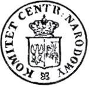 <!--.element: style="width: 200px; float: right;right:-50px;z-index: 100;position: relative;"-->
The Central National Committee (Komitet Centralny Narodowy) formed the leadership basis of the faction.

--
<!--.slide: data-background-image="./pics/goraDuring.png" class="text-bg-clr"-->
### The Reds

#### Notable members
* Oskar Awejde
* Stefan Bobrowski
* Ignacy Chmieleński
* Jarosław Dąbrowski
* Apollo Korzeniowski
* Agaton Giller
* Ludwik Mierosławski
* Zygmunt Padlewski
* Zygmunt Sierakowski
* Bronisław Szwarce

--
<!--.slide: data-background-image="./pics/radomForest.png" class="text-bg-clr"-->

In general, the Reds represented liberal intellectuals while the Whites based their support on progressive landlords. The Reds were based in Warsaw and concentrated around the Warsaw Medical Academy, while the Whites' base of support was in Kraków. 

---
<!--.slide: data-background-image="./pics/warsawForest.png" class="text-bg-clr"-->
## January Uprising

--
### Nikolay Milyutin (1818 – 1872)

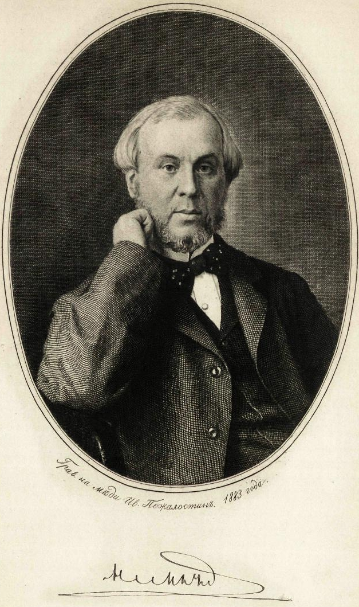 <!--.element: style="width: 200px; float: left;left:-50px;z-index: 100;position: relative;"-->

The famous architect of Alexander II's liberal reforms was dispached to Poland to implement reforms. He orchestrated an emancipation of the peasantry at the expense of the nationalist landowners and the expulsion of Roman Catholic priests from schools. Russificaion on the one hand, and appeasment of the lower-classes on the other.
--

<!--.slide: data-background-image="./pics/conscription.png" class="blur"-->

The forced conscription
( Branka [trans. Roundup] Polonia cycle – Artur Grottger)

--
--
<!--.slide: data-background-image="./pics/forcedDraft.png" class="text-bg-clr"-->

On the 14th of January 1863, a sudden attempt by the Tsar to crack down on potential political agitators and nationalist ne'er-do-wells was attempted by a decree of a mass conscription into the Imperial Army.
The aspiring revolutionaries - revolted, took to the woods and took up arms against the foreign regime. It was soon joined by high-ranking Polish-Lithuanian officers and various politicians. The insurrectionists, severely outnumbered and lacking serious outside support, were forced to resort to guerrilla warfare tactics. 

--
<!--.slide: data-background-image="./pics/path" class="text-bg-clr"-->
was formed in the night of 22 on 23 January 1863 as a result of the transformation of it from the Central Committee of the National and was the highest executive body in the uprising . Provisional Government signed the " Manifesto ," in which he called for the fight and announce the enfranchisement of peasants , which remained a fiction because of the inability to enforce the decision. The government has proposed a person Ludwika Mierosławskiego the uprising dictator, but this after losing two battles resigned to take the position. After the takeover of power by the party of white TRN changed its name to the National Government .
National Government had legislative power and the executive , created his own secret state administration, responsible, among others, for collecting taxes , the operation of a secret e-mail , edit the press.
The arrest Romuald Traugutta 10 April 1864 r. Is considered to be the end of the activities of the National Government during the January uprising.
--

<!--.slide: data-background-image="./pics/January_Uprising_proclamation_1863.PNG" class="blur"-->

Proclamation of the <i>Polish National Government</i> 

--
<!--.slide: data-background-image="./pics/January_Uprising_proclamation_1863.PNG" class="blur"-->

Maria Ilnicka - Wrote the 1863 manifesto 

--
<!--.slide: data-background-image="./pics/January_Uprising_proclamation_1863.PNG" class="blur"-->

 

Maria Ilnicka - Wrote the 1863 manifesto 

--
<!--.slide: data-background="white" -->

### Ludwik Mierosławski 

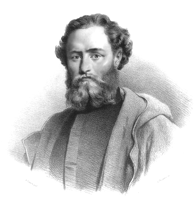 <!--.element: style="width: 400px; float: left;left:-50px;z-index: 100;position: relative;"-->

The first of four dictators of the Uprising. Took part in the November Uprising of the 1830s, as well as fought for the insurgents in Baden and in the Electorate of the Palatinate 1848-49.
A member of the Polish Democratic Society.

--
<blockquote>
Having read about the beginning of the revolt from newspapers, Dostoevsky began his private notebook of 1863 with the question: ‘‘What is the real war?— The Polish war is the war of two Christianities [Christian denominations— N.P.], this is the beginning of the future war of Russian Orthodox Christianity with Catholicism, in other words—of the Russian genius and European civilization. Here the progress is ours—and not an official progress (in agreement with the Dutch formula), but the peoples’ progress.’’ { F. M. Dostoevskii, Polnoe sobranie sochinenii v tridtsati tomakh (Leningrad: Nauka, 1972–90), 20:170   Quoted in: Perlina, Nina. “Dostoevsky and His Polish Fellow Prisoners from the House of the Dead.” In Polish Encounters, Russian Identity, edited by David L. Ransel and Bozena Shallcross, 100–109. Bloomington, IN: Indiana University Press, 2005. p.100 | 12}
</blockquote>

--
<!--.slide: data-background-image="./pics/Rok_1863_Polonia.jpg" class="blur"-->

"Polonia (Poland), 1863", by Jan Matejko, 1864, oil on canvas, 156 × 232 cm, National Museum, Kraków. Pictured is the aftermath of the failed January 1863 Uprising. Captives await transportation to Siberia. Russian officers and soldiers supervise a blacksmith placing shackles on a woman (Polonia). The blonde girl next to her represents Lithuania.

--
<!--.slide: data-background-image="./pics/forging-scythes.png" class="blur"-->

Forging of war scythes. 
In the background, two insurgents armed with guns in a four-cornered caps with sewn red and white ribbons in the national colors.
(Kucie kos - Polonia cycle – Artur Grottger)

--
<!--.slide: data-background-image="./pics/Scythemen.png" class="blur"-->

 Scythemen during Poland's January 1863 Uprising

--

<!--.slide: data-background-image="./pics/Shelter.png" class="blur"-->

A Jewish man warning a wounded insurgent on an approaching Russian regiment.  (Schronisko (trans. Shelter) - Polonia cycle – Artur Grottger)

--
<!--.slide: data-background-image="./pics/ObronaDworu.png" class="blur"-->

Obrona Dworu [trans. Manor’s Defence] - Polonia cycle – Artur Grottger

--
<!--.slide: data-background-image="./pics/ObronaDworu.png" class="blur"-->

Bitwa (trans. Battle) - Polonia cycle – Artur Grottger

--
<!--.slide: data-background-image="./pics/pobojowisku.png" class="blur"-->

Na pobojowisku (trans. On the battlefield) - Polonia cycle – Artur Grottger

--
<!--.slide: data-background-image="https://upload.wikimedia.org/wikipedia/commons/e/ec/Listovka_povstancev_1863_goda.jpg" class="blur"-->

**English**: A Polish-language flyer from the January Uprising. The text reads: You, priest, shall hang like this, unless you improve your ways / And crows will prey on your flesh. How awful death this must be??? / If your tongue still itches you to lie to peasants in the church, you'd better pierce it with a needle!!

**Polski**: To ty, Popie, będziesz podobnie wisiał, jeżeli się nie poprawisz.!! Jeżeli ci jeszcze język swierzbię do szczekania w cerkwie chłopom bredniow, to go lepiej nakol szpilką!! A kruki będą się nasycać twoim Ciałem!!! Jakaż to haniebna smierć być musi???

**Русский**: Прокламация, найденная в обозе повстанческого отряда Нарбута, разогнанного 15 июля 1863 г. военными в Пинском уезде. "Это ты, поп, будешь так висеть, если не исправишься. Если у тебя еще чешется язык брехать в церкви хлопам бредни, то лучше наколи его шпилькой!! А вороны будут насыщаться твоим телом!!! Ах, какая же это будет позорная смерть???"

--
<!--.slide: data-background-image="./pics/0_7e36c_a6ca7526_XL.jpg" class="blur"-->

--
<!--.slide: data-background-image="./pics/centralComitee.jpg" class="blur"-->

The Seal of the National Central Committee, which sealed the originals of three documents from January 22, 1863. Soon the Committee, as the Provisional National Government, will begin using another seal, with the image of the Archangel Michael symbolizing Rus.

--
<!--.slide: data-background-image="./pics/scythians.png" class="blur"-->

The scythe of scythians, an illustration from the French magazine '' Le Monde Illustre '', 1863

--
<!--.slide: data-background-image="./pics/peasentsPostcard.png" class="blur"-->

The peasants have not yet risen - a propaganda postcard from the January Uprising, polemizing with the view that peasants did not join the fight. It shows the peasants leading the fire in a lying position.

--
<!--.slide: data-background-image="./pics/kovel.png" class="blur"-->

Polish-Russian clash at Kovel on Volhynia in 1863

--
<!--.slide: data-background-image="./pics/leavingGrodno.png" class="blur"-->

The insurgent party leaves Grodno

--
<!--.slide: data-background-image="./pics/Druzkopola.png" class="blur"-->

The entry of troops into insurgent Drużkopola the Volyn

--
<!--.slide: data-background-image="./pics/Muravyov.png" class="blur"-->

Michaił Murawjow Wileński "Hangman" in Lithuania

--
## The underground government
Piłsudski: "The greatness of our nation in the great epoch of 1863 consisted in its government, which, unknown by name, was respected and obeyed in a manner that should make all countries and all nations jealous" {A lecture delivered in 1924 entitled Rok 1863 [The Year 1863] Józef Piłsudski o powstaniu 1863 roku [Józef Piłsudski on the January uprising] (London, 1963), p. 153. |1}

---

<!--.slide: data-background-image="./pics/AllianceOfPolishNobilityAndPeasantDuringJanuaryUprising.png" class="text-bg-bw"-->

Alliance of Polish nobility and peasant during January Uprising

--

<!--.slide: data-background-image="./pics/woundedMinsk.png" class="text-bg-clr"-->

Public executions and deportations to Siberia led many Poles to abandon armed struggle and turn instead to the idea of "organic work": economic and cultural self-improvement.

---
<!--.slide: data-background-image="./pics/hangingOfPoles.png" class="text-bg-clr"-->

---
### The Polish professional revolutionary exiles

--
<blockquote>
I can only say that the insurrection, however much of heroism and patriotic devotion it has subsequently embodied, appears to me to have been to a great extent artificially stimulated by the wonderfully dextrous managment of the press and the telegraph and by a social machinery which no other nation than one of generations of illustrious exiles can command.
 <cite> - Henry Hotze {The American Cofederacy's chief publicity agent in England, in a letter to J.P.Benjamin. Dec. 26, 1863. Cited by Kutolowski, John F., The West And Poland, ect' p.85 | 2} </cite>
</blockquote>
--

"While it is often and quite justifiably remarked that there was hardly a barricade or battlefield in Europe between 1830 and 1870 where no Poles were fighting, this is especially true for the revolution of 1848/1849." {Dowe, Dieter. Europe in 1848 : Revolution and Reform. Berghahn Books, 2001. https://books.google.co.il/books?id=B3qRFCn5CHoC&pg=PA180&dq=Polish+romantic+revolutionaries&sig=cOYtkxH_i8lEX_0VUMEVhwGLVWs&redir_esc=y. p.180 | 1}
--

#### The Polish Propoganda

'The Russian Consul General had earlier written letters to the _Morning Post_, May 16 and 21, countering the stories of Russian atrocities. at least one Russian writer pressed the (Russian?) Minister of War in June to increase Russian propoganda: "It is known the the Polish party spends enormous sums on attracting all the organs of the public opinion in Western Europe to its side and that it organized what could be called a whole factory for news and articles..." {McCauley, Martin, and Peter Waldron. The Emergence of the Modern Russian State, 1855–81. London: Palgrave Macmillan UK, 1988   p.163   Cited by F. Kutolowski, John. “Mid-Victorian Public Opinion, Polish Propaganda, and the Uprising of 1863.” In The West And Poland: Essays on Governmental and Public Responses to the Polish National Movement, 1861-1864, 153–82. Michigan: University of Michigan, 2000. p.113 | 1}

---

## The uprising in the international arena

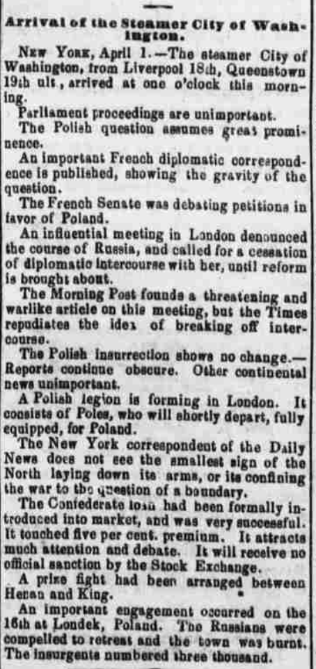
{Daily Ohio statesman. (Columbus, Ohio), 02 April 1863. Chronicling America: Historic American Newspapers. Lib. of Congress. <http://chroniclingamerica.loc.gov/lccn/sn84028645/1863-04-02/ed-1/seq-1/>|1}

---

## The diplomatic impact of the uprising on the American Civil War

--
<!--.slide: data-background-image="./pics/1863LincolnRussia.jpg" class="blur"-->

--
## Visit of the Russian fleet

During the winter of 1861–1862, the Imperial Russian Navy sent two fleets to American waters to avoid their getting trapped if a war broke out with Britain and France. Many Americans at the time viewed this as an intervention on behalf of the Union, though historians deny this.[53] The Alexander Nevsky and the other vessels of the Atlantic squadron stayed in American waters for seven months (September 1863 to June 1864){Thomas A. Bailey, "The Russian Fleet Myth Re-Examined," Mississippi Valley Historical Review, Vol. 38, No. 1 (Jun., 1951), pp. 81–90| 1}

## Polish-Americans

Count **Adam Gurowski** (born in the Kalisz, Poland, 10 September 1805; died in Washington, D.C., 4 May 1866) was a Polish-born author who emigrated to the United States in 1849.

### Nos Amis Les Cosaques! {Hailprin, Michael. “Nos Amis Les Cosaques.” The Continental Monthly: Devoted to Literature and National Policy 5, no. 2 (1864): 216–21. http://ebooks.library.cornell.edu/cgi/t/text/pageviewer-idx?c=cont;cc=cont;g=moagrp;xc=1;rgn=full%20text;idno=cont0005-2;didno=cont0005-2;node=cont0005-2%3A11;view=image;seq=0222. | 1}

--

By one M. Haielprin, a prolific Jewish abolitionist and scholar.  In 1864 he contributed a paper entitled "Nos Amis les Cosaques" to the Boston Continental Monthly, a periodical founded by the poet Charles G. Leland, whose acquaintance he had made in Philadelphia. {Adler, Cyrus, and Gustav Pollak. Michael Heilprin and His Sons: A Biography. New York: Dodd, Mead and company, 1912. doi:10.2307/1450943. p.192 |3}

--

The Continental Monthly, a magazine owned by Mrs. Martha Cook, one of the rare American workers for the Polish cause at the time, published two articles in 1864. One, printed in the January issue under the French title "Nos Amis les Cosaques/" was an indictment of America's Russophilia by Michael Heilprin, the son of a well-known rabbinical family and a secretary of the Washington Polish Committee.{Wieczerzak, Joseph. “Pre-and Proto-Ethnics: Poles in the United States Before the Immigration ‘After Bread.’” The Polish Review 21, no. 3 (1976): 7–38. http://www.jstor.org/stable/25777399. p.34 |2}
