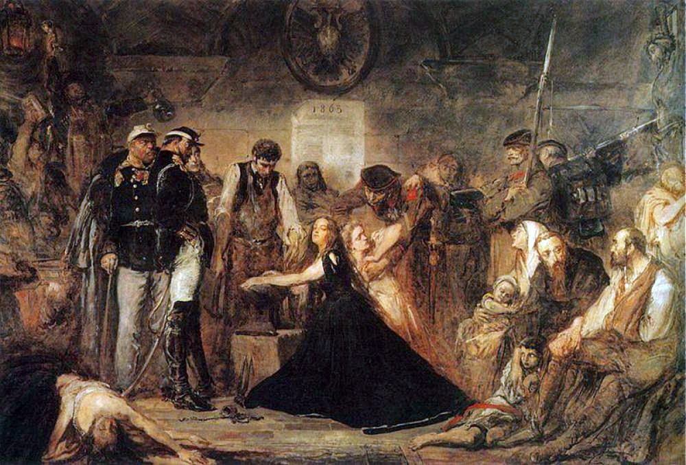

---

Russian army in Warsaw during martial law 1861

---

---

"Polonia (Poland), 1863", by Jan Matejko, 1864, oil on canvas, 156 × 232 cm, National Museum, Kraków. Pictured is the aftermath of the failed January 1863 Uprising. Captives await transportation to Siberia. Russian officers and soldiers supervise a blacksmith placing shackles on a woman (Polonia). The blonde girl next to her represents Lithuania.
---

The forced conscription
( Branka [trans. Roundup] Polonia cycle – Artur Grottger)
---

Forging of war scythes. 
In the background, two insurgents armed with guns in a four-cornered caps with sewn red and white ribbons in the national colors.
(Kucie kos - Polonia cycle – Artur Grottger)
---

 Scythemen during Poland's January 1863 Uprising
---

A Jewish man warning a wounded insurgent on an approaching Russian regiment.  (Schronisko (trans. Shelter) - Polonia cycle – Artur Grottger)
---

Obrona Dworu [trans. Manor’s Defence] - Polonia cycle – Artur Grottger
---

Bitwa (trans. Battle) - Polonia cycle – Artur Grottger
---

Na pobojowisku (trans. On the battlefield) - Polonia cycle – Artur Grottger
---

[source](https://commons.wikimedia.org/wiki/File:Listovka_povstancev_1863_goda.jpg)

**English**: A Polish-language flyer from the January Uprising. The text reads: You, priest, shall hang like this, unless you improve your ways / And crows will prey on your flesh. How awful death this must be??? / If your tongue still itches you to lie to peasants in the church, you'd better pierce it with a needle!!

**Polski**: To ty, Popie, będziesz podobnie wisiał, jeżeli się nie poprawisz.!! Jeżeli ci jeszcze język swierzbię do szczekania w cerkwie chłopom bredniow, to go lepiej nakol szpilką!! A kruki będą się nasycać twoim Ciałem!!! Jakaż to haniebna smierć być musi???

**Русский**: Прокламация, найденная в обозе повстанческого отряда Нарбута, разогнанного 15 июля 1863 г. военными в Пинском уезде. "Это ты, поп, будешь так висеть, если не исправишься. Если у тебя еще чешется язык брехать в церкви хлопам бредни, то лучше наколи его шпилькой!! А вороны будут насыщаться твоим телом!!! Ах, какая же это будет позорная смерть???"
---

---

The Seal of the National Central Committee, which sealed the originals of three documents from January 22, 1863. Soon the Committee, as the Provisional National Government, will begin using another seal, with the image of the Archangel Michael symbolizing Rus.

---

The scythe of scythians, an illustration from the French magazine '' Le Monde Illustre '', 1863
---

The peasants have not yet risen - a propaganda postcard from the January Uprising, polemizing with the view that peasants did not join the fight. It shows the peasants leading the fire in a lying position.
---

Polish-Russian clash at Kovel on Volhynia in 1863
---

The insurgent party leaves Grodno
---

The entry of troops into insurgent Drużkopola the Volyn
---

Michaił Murawjow Wileński "Hangman" in Lithuania

------

---

# Med

---

----------------------------------------------------------------
|                                                                |
|                         ## Hodge Podge                         |
|                                                                |
|                                                                |
------------------------------------------------------------------

Adam Jerzy Czartoryski Also known as Adam George Czartoryski in English; 14 January 1770 – 15 July 1861

Lewel - An historian and a central revolutionary figure

[The Free State of Cracow 1815-1846](http://www.jstor.org/stable/pdf/4203915.pdf)

---

# ..61

---

# Upheaval aftermaths:

- Aleksander Wielopolski

---

# 	22 January 1863 – 18 June 1864
Polish: powstanie styczniowe

---

Karol Majewski - 

---

Konstanty Kalinowski -  leader of the January Uprising in lands of the former Grand Duchy of Lithuania in the Polish-Lithuanian Commonwealth.

---

outbreak of January Uprising he was involved in the secret Provincial Lithuanian Committee in Vilnius (Prowincjonalny Litewski Komitet w Wilnie). Soon he was promoted to the commissar of the Polish government for the Grodno Voivodeship. His writings made him popular both among the peasants and the gentry, which enabled the partisan units under his command to grow rapidly. Because of his successes he was promoted to the rank of Plenipotentiary Commissar of the Government for Lithuania (Komisarz Pełnomocny Rządu na Litwę), which made him the commander-in-chief of all partisan units fighting in the areas of today's' Eastern Poland, Lithuania, Belarus and Ukraine.
Arrested in late Januar

---

## Stanisław Brzóska

(December 30, 1832, Dokudów Pierwszy – May 23, 1865, Sokołów Podlaski) was a Polish priest, general, one of leaders of the Polish insurgency and the last partisan of the January Uprising.

---

The Government of England has made a demonstration in favor of the Poles that cannot fail to excite for their cause the warmest sympathy, and give strength to the insurrectionary movement. The Earl of Ellenborough took occasion in the House of Lords, on the 10th of February, to ask the Ministry for any papers it possessed on the subject cf Poland, and in doing so commented with just severity upon the tyrannies of Russia, and the unhappy condition to which it had reduced the proud and gallant nation of the Poles. This was responded to by Earl Russell, in behalf of the Government .- He did not think it expedient to produce the information sought by the Earl of Ellenborough,  and could not without mature reflection indicate the policy that England would pursue in dealing with the Polish question. He was very decided however, in thinking that Russia had done wrong in her government of Poland and had told the Russian Minister that **the decree of conscription "was the most imprudent and unjust step the Russian Government could take."** This sentiment, we are told, was received with loud cheering, and when the noble Earl went on to say that Prussia had made herself a partner in the wrong by entering into a convention with Russia, the cheering was renewed. These indications of disapprobation showed how aristocratic England regarded the tyrannies of aristocratic Russia. We can well imagine that there must be more than usual pathos in this national cry of Polish anguish to move the cold and august noblemen in the House of Lords. This cry has hushed the strife of parties, for we hear that, immediately upon the conclusion of the Earl of Russell's speech, the Earl of Malmesbury, a member of the Opposition, and a follower of Lord Derry and his foreign secretary, arose, and expressed his approval of the sentiments of the Government; expressed his "sincere sorrow at what he had been told was the attitude of the Russian Government." This demonstration in the House of Lords is everywhere sustained, and the sentiment of England is decidedly in sympathy with the Poles.

---

It may be said to be equally so in France. The Emperor of deeds has said nothing, and,-as yet, does nothing; but French sentiment is decidedly in sympathy with Poland. The ominous mutterings of a muzzled press; the gossip in the saloons ; the debates in the national assemblies; all indicate coldness to Russia and kindness to the suffering people now being massacred by her armies. Austria has taken a high stand, and washes her hands of a transaction which is at best but little more than the natural effect of the perfidy of a former Austrian minister. Prussia has made herself virtually an ally of Russia, by entering into a convention for the purpose of preventing Polish rebels taking refuge in her dominions, and agreeing to return them to the Russian authority. Whether Prussia which, notwithstanding the vacillation and obstinacy of her present ruler, is a proud and just nation, and strongly devoted to the liberal sentiment of Europe -  will consent to become a minion of an autocracy and the instrument of a tyranny which the world cannot equal, remains to be seen. The King of Prussia has done much to estrange his people, and many wise men fear an outbreak against his own authority, and we think it would be well for him not to court additional odium by his conduct in this unfortunate insurrection. Thus far, the insurrection has been little more than a series of outbreaks and massacres, although some of the writers of European journals state that the conduct of the Poles has been marked by humanity and discretion; that they have organized armies, and, under the leadership of a distinguished Polish nobleman, are fast becoming proficient in the art of war.** If this contest should be permitted to continue, we do not see how anything can result but the utter annihilation of the Polish nationality.** It was, indeed, the attempt to carry out this design, by forcing a merciless and unjust conscription, that led to the present insurrection. It is possible that the combined Powers of Europe may present to Russia such a remonstrance that she will desist from her present sad design, and **it is by no means impossible that, out of the revolution and excitement which despairing Poland has created in her effort to become free, the great crime of its partition, which has been for a generation the shame of Europe, will be redressed. As friends of liberty, we shall look upon such result as one of the most pleasant events of the age.** {The Alleghanian. (Ebensburg, Pa.), 19 March 1863. Chronicling America: Historic American Newspapers. Lib. of Congress. http://chroniclingamerica.loc.gov/lccn/sn85054845/1863-03-19/ed-1/seq-2/ |1}

---

##    Notes on Polish Uprising Seminar

13.12

Reading Ferrie's 1994 paper on Immigrant Wealth Accumulation informs me of an extensive American census of immigrant ships between 1840 to 1870.
Furthermore, the exact same method used in the article can be used to study the patterns of Polish immigrants after the '63 uprising, perhaps.

Sites to check:
  HyperCities.com
  storymaps.esri.com
  neatline.org

---

### From Dr. Spitzer's lecture:
  Landsmansschaft (Hometown based association)
  He mentions he compiled a database of these assosiasion and their place of origin

  17.12
  (16-12-17 18:51) Found http://www.polishmigration.org/ - A database of 19th century Polish immigration to the USA

  Citation:
   A Polish chapter in Civil War America: the effects of the January insurrection on American opinion and diplomacy / Wieczerzak

   LERNER, H. (1961). THE QUESTION OF A POLISH LEGION AND POLISH IMMIGRATION DURING THE SECOND MEXICAN EMPIRE. The Polish Review, 6(3), 99-107. Retrieved from http://www.jstor.org/stable/25776361

  Wieczerzak, Joseph. “American Reactions to the Polish Insurrection of 1863.” Polish American Studies, vol. 22, no. 2, 1965, pp. 90–98. www.jstor.org/stable/20147692.

  Grzybowska, Zofia. “A Contribution to Polish-American History: Nineteenth Century Catholic Serials in the United States.” Polish American Studies, vol. 12, no. 3/4, 1955, pp. 84–87. www.jstor.org/stable/20147396.

  Teresa, M. “Polish Settlements in Minnesota, 1860-1900.” Polish American Studies, vol. 5, no. 3/4, 1948, pp. 65–73. www.jstor.org/stable/20147156.

  WARDZIŃSKI, ZYGMUNT. “ENGLISH PUBLICATIONS OF POLISH EXILES IN THE UNITED STATES: 1808-1897.” The Polish Review, vol. 40, no. 4, 1995, pp. 457–468. www.jstor.org/stable/25778887.

  Immigrants and Associations: A Global and Historical Perspective. Jose C. Moya. Journal Of Ethnic And Migration Studies Vol. 31 , Iss. 5,2005

  Kaufman, Martin. “1863: Poland, Russia and the United States.” Polish American Studies, vol. 21, no. 1, 1964, pp. 10–15. www.jstor.org/stable/20147660.

  Coleman, Arthur Prudden. “What 1863 Means to American Friends of Poland.” Polish American Studies, vol. 23, no. 1, 1966, pp. 59–61. www.jstor.org/stable/20147714.

  Kolinski, Dennis. “The Origin and Early Development of Polish Settlements in Central Wisconsin.” Polish American Studies, vol. 51, no. 1, 1994, pp. 21–48. www.jstor.org/stable/20148428.

Found a journal dedicated to the study of Polish Americans - *Polish American Studies*. Might find more useful material there.
http://www.jstor.org/journal/poliamerstud

Discovered *Topicgraph* by JStor, a new topic modeling tool
https://jstor-labs.github.io/topicgraph/

US GIS Census Tools: http://americanmigrations.uic.edu/censustools.htm
---
(16-12-23 18:22) 
* [Visualizing Algorithms](https://bost.ocks.org/mike/algorithms/)
* [How To Infer Topology](https://bost.ocks.org/mike/topology/)
* [topojson/topojson: An extension of GeoJSON that encodes topology🌐](https://github.com/topojson/topojson)
* [Data Mining the Internet Archive Collection | Programming Historian](http://programminghistorian.org/lessons/data-mining-the-internet-archive)
* [Downloading Multiple Records Using Query Strings | Programming Historian](http://programminghistorian.org/lessons/downloading-multiple-records-using-query-strings)
* [Intro to Beautiful Soup | Programming Historian](http://programminghistorian.org/lessons/intro-to-beautiful-soup)
* [Keywords in Context (Using n-grams) with Python | Programming Historian](http://programminghistorian.org/lessons/keywords-in-context-using-n-grams)
* [R Basics with Tabular Data | Programming Historian](http://programminghistorian.org/lessons/r-basics-with-tabular-data)
* [Using Gazetteers to Extract Sets of Keywords from Free-Flowing Texts | Programming Historian](http://programminghistorian.org/lessons/extracting-keywords)

!Chronicling America: America Library Of Congress National Digital Newspaper Program
http://chroniclingamerica.loc.gov/

Links to APIs and documentation:  The Library makes available the digitized text (created through Optical Character Recognition) of more than three million newspaper pages in the METS/ALTO XML format (see http://www.loc.gov/standards/alto/).  For each page of OCR text, the library includes a permanent link to an image of the page, from which additional metadata can be derived.

The Library provides an OpenSearch API [1], with results returned in HTML, JSON, or Atom, at the researcher's discretion.  From the search results, the Library provides pointers to additional information for each result based upon a URI Template. [2]

[1.] http://www.opensearch.org/Home

[2.] http://bitworking.org/projects/URI-Templates/spec/draft-gregorio-uritemplate-03.txt
---
# Using R #

* [Code School - Try R](http://tryr.codeschool.com/levels/2/challenges/35)
* [R Basics with Tabular Data | Programming Historian](http://programminghistorian.org/lessons/r-basics-with-tabular-data)
* [Digital humanities with R — rOpenGov](http://ropengov.github.io/r/2015/06/12/Paris/)
* [Digital History Methods in R](http://lincolnmullen.com/projects/dh-r/index.html)
* [A gentle introduction to text mining using R | Eight to Late](https://eight2late.wordpress.com/2015/05/27/a-gentle-introduction-to-text-mining-using-r/)
* [Text Mining in R Tutorial: Term Frequency & Word Clouds](https://deltadna.com/blog/text-mining-in-r-for-term-frequency/)
* [Statistical Methods for Studying Literature Using R](http://www.chlt.org/StatisticalMethods/index.html)
---
## Tools

* [Palladio - Visualize complex historical data with ease](http://hdlab.stanford.edu/palladio/)

(16-12-27 11:01) 
- I have to read Borgman's book on data this weekend!
* [http://labs.europeana.eu/api/linked-open-data-SPARQL-endpoint] (Europeana's SPARQL tutorial)
- [Database Design Tutorial](http://port.sas.ac.uk/mod/book/view.php?id=75&chapterid=130)
---
(16-12-31 19:15) 

American Reactions to the Polish Insurrection of 1863
Author(s): Joseph Wieczerzak
Source: Polish American Studies, Vol. 22, No. 2 (Jul. - Dec., 1965), pp. 90-98

> Much was added to the legacy over three decades before when, at the time of the Polish November Insurrection, a wave of Polonophilia swept over Jacksonian America; when hardly a day went by without some sympathetic mention of Poland in newspaper editorials; when banners for the Polish insurgents were dedicated in Boston, Polish dances were taught in New York dancing schools, a plethora of amateur verse on Polish themes found its way into print, and public protest meetings and collections were undertaken throughout the country.

[Polish Archives in America](http://www.piasa.org/archivesinamericabs.html)
---
### Polish Falcons of America.

[About Us](http://www.polishfalcons.org/history)

Brief History
From its beginnings, Polish identity has been ingrained within the mission and activities of Polish Falcons of America.

For hundreds of years, Poland was a major European economic, political powerhouse and the largest country in Europe. Seen as a threat to the neighboring authoritarian empires of Russia, Prussia and Austria, in the late 1700s Poland was invaded, its vast territory divided and its culture and language suppressed.  This foreign occupation was brutal, lasting over 120 years, and resulted in a series of unsuccessful insurrections against this foreign oppression.

The modern Falcon organization is a direct descendent of a similar organization established in Poland four years after the unsuccessful January Uprising of 1863 against Czarist Russia.   Devoted to physical fitness and physical education, the Polish Falcons adopted the Latin maxim "mens sana in corpore sano," or in Polish, “w Zdrowym Ciele, Zdrowy Duch" - "A Healthy Spirit in a Healthy Body." Such efforts were intended to “regenerate” the Polish nation through disciplined physical fitness, preparing the nation for eventual independence. In this spirit, the first Falcon Nest, or lodge, in the United States was organized by Felix L. Pietrowicz in Chicago, Ill. in 1887.   In 1912, the organization’s headquarters were moved to Pittsburgh, which is centrally located between the two largest centers of Polish-American communities, New York and Chicago.  These American Falcons adopted as their patron the Polish Patriot, Tadeusz Kosciuszko, who fought for both the independence of Poland and the United States.

The vision of a resurrected, free Poland was close to the hearts of the early Falcon organization, which became a leader among Polish-American groups in working toward this goal.  By 1917, over 25,000 young Polish-American men were trained by the Polish Falcons to serve in a proposed Polish military force.  During World War I, these Falcon-trained troops became the core of the Polish-American expeditionary force in France and the eventual nucleus of the Polish Army.  At the Polish Falcons Convention held in Pittsburgh on April 3, 1917, the renowned pianist and future premier of newly independent Poland, Ignacy Paderewski, delivered a rousing speech that sparked the recruitment of a Polish Army in the United States to fight for the Western Allies against Germany.  Over 35,000 Polish-American men enlisted in the Allied war effort.   In particular, these Falcon trained troops fought in the famous “Blue Army” under the leadership of General Jozef Haller. When Poland regained its independence in 1918, these troops helped to form the nucleus of the young country’s armed forces as neighboring countries immediately attacked Poland, including the fierce Bolshevik Red Army that was planning on spreading communism into Europe by invading Poland.

Once Polish independence was secured, the Polish Falcons of America could turn its attention to improving the lives of its Members. The early part of the 20th century was a time when few social services were available and working conditions, particularly for Polish immigrants, were particularly harsh.  There were no public health and recreation programs, no social security or retirement benefits, and conditions in the work place were often dangerous.  Immigrant men were forced to work extremely long hours for little pay, under difficult and often life-threatening conditions.  If the head of the house died in an industrial accident or was incapacitated, the surviving family often faced impoverishment.  Polish Falcons of America addressed these problems by offering life insurance programs for the Polish-American community at reasonable cost. The Falcons also offered recreational activities for Falcon youth in areas where no other such services were available.  And, combined with these and other programs, the Falcons remained loyal to their commitment to the Polish heritage.

---

http://www.marquette.edu/library/theses/already_uploaded_to_IR/stec_c_1946.pdf
Contains a table of Polish immigration to the US between 1860-1940

http://dsl.richmond.edu/panorama/foreignborn/#decade=1870&country=Poland
No data about Polish immigrants before 1870 - why?

---

How is 'the event' even named? <= This is a great question in and of itself!

---

## Primary Sources

[Search · Digital Public Library of America](https://dp.la/search?language%5B%5D=English&subject=Poland--History--Revolution%2C+1863-1864)

[The Russian government in Poland : with a narrative of the Polish Insurrection of 1863 : Day, William Ansell : Free Download & Streaming : Internet Archive](https://archive.org/details/russiangovernmen00daywuoft)

[Category:January Uprising documents - Wikimedia Commons](https://commons.wikimedia.org/wiki/Category:January_Uprising_documents)

[Jagiellonian Digital Library - January Uprising](http://jbc.bj.uj.edu.pl/dlibra/collectiondescription?dirids=547)

[The Polish captivity: an account of the present position of the Poles in the kingdom of Poland, and in the Polish provinces of Austria, Prussia, and russia · Digital Public Library of America](https://dp.la/item/8efa1b72a1aaa4ecf9e5e3c033dc045d?back_uri=https%3A%2F%2Fdp.la%2Ftimeline%3Fsubject%255B%255D%3DPoland%26subject%255B%255D%3DPoland--History%23%2F1863)

[Search Results for abarbanel - FamilySearch.org](https://familysearch.org/search/record/results?count=20&query=%2Bsurname%3Aabarbanel~%20%2Bbirth_place%3Aturkey~)

[New York Heritage Digital Collections](http://cdm16694.contentdm.oclc.org/cdm/search/searchterm/Poland--History--Revolution)

[Timeline · Digital Public Library of America](https://dp.la/timeline?&subject%5B%5D=Poland--History#/1863)

[Newspapers.com - Historical Newspapers from 1700s-2000s](https://www.newspapers.com/)

[Database of January insurgents](http://www.genealogia.okiem.pl/powstanies/)

[Partitioned Poland 1795-1918 - EuroDocs](https://eudocs.lib.byu.edu/index.php/Partitioned_Poland_1795-1918)

[Poland: Historical Collections - EuroDocs](https://eudocs.lib.byu.edu/index.php/Poland:_Historical_Collections)

[Jagiellonian Digital Library - January Uprising](http://jbc.bj.uj.edu.pl/dlibra/pubindex?startint=40&attId=${stringAtt}&dirids=547)

---

Works mailed to mail.tau.ac.il:

* [Harvard Mirador Viewer](https://iiif.lib.harvard.edu/manifests/view/drs:4433759$8i)

* [Harvard Mirador Viewer](https://iiif.lib.harvard.edu/manifests/view/drs:4093482$15i)

* [Harvard Mirador Viewer](https://iiif.lib.harvard.edu/manifests/view/drs:4319312$1i)

* [Harvard Mirador Viewer](https://iiif.lib.harvard.edu/manifests/view/drs:5642203$1i)

* [Harvard Mirador Viewer](https://iiif.lib.harvard.edu/manifests/
view/drs:4669917$1i)

* [Harvard Mirador Viewer](https://iiif.lib.harvard.edu/manifests/view/drs:4656603$1i)

* [Harvard Mirador Viewer](https://iiif.lib.harvard.edu/manifests/view/drs:4656556$12i)

---

Images:

"Marching off Polish Patriots to Siberia." Illustrated London News [London, England] 14 Feb. 1863: 169. Illustrated London News. Web. 16 Feb. 2017.

[URL](http://find.galegroup.com/iln/infomark.do?&source=gale&prodId=ILN&userGroupName=tel_aviv&tabID=T003&docPage=article&docId=HN3100060929&type=multipage&contentSet=LTO&version=1.0)

## Ken Lin
- 1846 insurrection
- "Secret societies among the gentry began to organize, spurred by the success of **the unification of Italy** and the abolition of serfdom"
- "The Agricultural Society"
- Feb. 1861 Warsaw upheavals which led to several Poles being killed.
- The Agricultural Society responded by sending a list of demands the the tsar, and local officials resigned or refused to work.
- Alexander II tried to appease the Poles by appointing new civil admins and holding **new elections**,
	while using military force against protestors in Castle Square in Warsaw.
-

### Search in newspapers
- "The Agricultural Society"
- Feb. 1861 Warsaw upheavals and the elections
- Protests in Castle Square
- The Avenbach Convention of Feb. 8 1863
- The visit of the Russian fleet
### File
##### People
- Alexander Wielopolski (1803-1877) - Appointed chief admin in 1861 by Alexander II. Led an agenda of limiting Polish autonomy through an 1832 statute, drafting Polish civil servants into the imperial bureaucracy.
###### Organizations
- The Agricultural Society
- The National Central Committee (KCN) - and umbrella organization of mostly students, artists and public servants nationalists

---
# Topic summary

[quote from newspaper]
whilsts the us was in the midsts of a civil war
at the hight of the civil war, an event tool place

perhaps start with the polish uprising, and then cross the ocean?

Not a month after the Emancipation Proclimaton

---
# Complete

* [~~1863 Uprising - Russia's Periphery~~](http://russiasperiphery.blogs.wm.edu/western-borderlands/poland/general/1863-uprising/)

---
(16-12-31 19:15) 

American Reactions to the Polish Insurrection of 1863
Author(s): Joseph Wieczerzak
Source: Polish American Studies, Vol. 22, No. 2 (Jul. - Dec., 1965), pp. 90-98

> Much was added to the legacy over three decades before when, at the time of the Polish November Insurrection, a wave of Polonophilia swept over Jacksonian America; when hardly a day went by without some sympathetic mention of Poland in newspaper editorials; when banners for the Polish insurgents were dedicated in Boston, Polish dances were taught in New York dancing schools, a plethora of amateur verse on Polish themes found its way into print, and public protest meetings and collections were undertaken throughout the country. 
---
## [Polish Archives in America](http://www.piasa.org/archivesinamericabs.html)

---
## the Central National Committee (Komitet Centralny Narodowy)  
---
## the Polish Provisional National Government (Tymczasowy Rząd Narodowy).

Association of Poles in America - Founded in 1842

List of Polish Exiles English publications in the US

2. [The Bilateral Effect of the Visit of the Russian Fleet in 1863](http://www.loyno.edu/~history/journal/1983-4/delehaye.htm)
